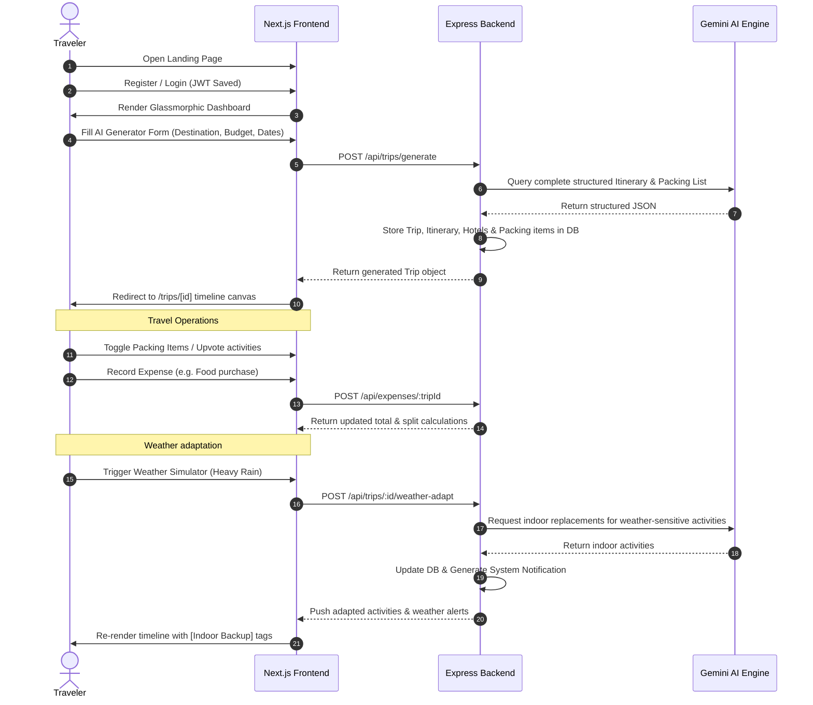

# TravelMitra - Intelligent Travel Planner & Itinerary Optimizer

TravelMitra is a decoupled full-stack next-generation travel assistant that helps users plan, optimize, and manage trips. It generates complete personalized itineraries using Google Gemini AI, and dynamically adapts schedules in real-time when the traveler reports sudden changes in weather or budget limits.

---

## System Architecture & User Flows

### System Architecture Diagram

```mermaid
graph TD
    %% Define styles
    classDef primary fill:#6366f1,stroke:#4f46e5,stroke-width:2px,color:#fff;
    classDef secondary fill:#a855f7,stroke:#9333ea,stroke-width:2px,color:#fff;
    classDef accent fill:#f43f5e,stroke:#e11d48,stroke-width:2px,color:#fff;
    classDef database fill:#0f172a,stroke:#334155,stroke-width:2px,color:#94a3b8;

    %% Nodes
    User([Traveler User]) -->|1. Register/Login| Auth[JWT Auth Middleware]
    User -->|2. Create Trip Form| API_Gen[AI Generator Route]
    
    subgraph Express Backend
        API_Gen -->|3. Call Gemini| Gemini[Gemini 1.5 Flash AI Engine]
        Gemini -->|4. Parse Itinerary Days, Packing, Hotels| DB[(SQLite / PostgreSQL DB)]
        
        API_Weather[Weather Adaptation Engine] -->|Check Forecast| Weather[OpenWeather API / Simulation]
        API_Weather -->|5. Replace Outdoor Activities| Gemini
        
        API_Expense[Expense Split & Tracker] -->|6. Calculate splits / categories| DB
        API_Expense -->|7. Exceed Limit Alert| Notify[Notification Dispatcher]
    end

    subgraph Next.js Frontend
        Dashboard[Glassmorphic Dashboard] -->|Show stats / saved trips| User
        Itinerary[Interactive Timeline Canvas] -->|Display Slots & Maps| User
        Chat[Contextual AI Chat Advisor] -->|Conversational advice| User
    end

    DB -->|Fetch current status| Dashboard
    DB -->|Render timeline| Itinerary
    Notify -->|Real-time alert popups| Dashboard
    
    class API_Gen,API_Weather,API_Expense primary;
    class Gemini,Weather secondary;
    class Dashboard,Itinerary,Chat,Notify accent;
    class DB database;
```


### User Sequence Flow


---

## Key Features

1. **AI Trip Generator**: Instantly generates comprehensive itineraries (Morning, Afternoon, Evening, Night) based on destination, travel style, budget, interests, food preference, and traveler counts.
2. **Dynamic Weather Planning**: Detects or simulates weather alerts (e.g., Heavy Rain) and automatically rewrites outdoor plans into shelter-friendly/indoor alternatives in-place.
3. **AI Budget & Expense Tracker**: Interactive logs representing spending categories, automatic remaining balances, split-bill calculations, and proactive warning notifications if budget limit is breached.
4. **Smart Packing Assistant**: Tailored lists of garments, documents, gear, and medication based on duration and weather, with checkbox tracking.
5. **Contextual AI Chat Advisor**: Built-in side drawer populated with the active trip details, responding instantly to questions like nearby restaurants, safety tips, local scam zones, and low-budget suggestions.
6. **Group Trip Collaboration**: Share itineraries with other users by email and collaboratively upvote or downvote activities in the schedule.
7. **Safety Radar & Emergency Mode**: Highlights embassy locations, medical facilities, police numbers, and local pickpocket/tourist scams cached for offline retrieval.

---

## Folder Layout

```
d:/travel
├── README.md                # General documentation & setup instructions
├── backend/
│   ├── src/
│   │   ├── index.ts         # Express server entry point
│   │   ├── controllers/     # Handlers (Auth, Trip AI, Chat, Expenses, Alerts)
│   │   ├── routes/          # Express REST API routing maps
│   │   ├── services/        # Third-party wrappers (Gemini, Weather APIs)
│   │   └── middlewares/     # JWT Token verification middleware
│   ├── prisma/
│   │   └── schema.prisma    # SQLite Prisma database model (14 tables)
│   ├── package.json         # Backend dependencies (Express, Bcrypt, Prisma v5)
│   └── tsconfig.json        # TypeScript configuration
└── frontend/
    ├── src/
    │   ├── app/             # Next.js App Router (Landing, Login, Signup, Dashboard, Trips)
    │   ├── components/      # UI components (Timeline, glassmorphic inputs)
    │   └── lib/             # API client class (stores JWT locally)
    ├── package.json         # Frontend dependencies (Next.js, Framer Motion, Lucide)
    └── tailwind.config.js   # Custom styling gradients & tokens
```

---

## System Requirements

- **Node.js**: `v18.x` or higher
- **NPM**: `v9.x` or higher
- **Gemini API Key** (Optional): Official key from Google AI Studio. The app automatically falls back to local high-fidelity AI simulation templates if this key is absent.

---

## Installation & Setup

### 1. Database & Backend Configuration

1. Navigate to the backend directory:
   ```bash
   cd backend
   ```

2. Create a `.env` file (one has already been generated with defaults):
   ```env
   PORT=4000
   JWT_SECRET=supersecretkeytravelplanner123!
   DATABASE_URL="file:./dev.db"
   GEMINI_API_KEY=YOUR_GEMINI_API_KEY
   OPENWEATHER_API_KEY=YOUR_OPENWEATHER_API_KEY
   ```

3. Run the database synchronization & Prisma client generation:
   ```bash
   npx prisma generate
   npx prisma db push
   ```

4. Start the backend development server:
   ```bash
   npm run dev
   ```
   The backend API will run on `http://localhost:4000`.

### 2. Frontend Configuration

1. Navigate to the frontend directory:
   ```bash
   cd ../frontend
   ```

2. Start the Next.js development server:
   ```bash
   npm run dev
   ```
   The frontend UI will run on `http://localhost:3000`.

---

## How to Test TravelMitra Features

1. **Landing & Account Registration**:
   - Go to `http://localhost:3000` and view the premium glassmorphism landing screen.
   - Click **Get Started** or **Sign In** and register a new traveler account.

2. **Generate AI Trip**:
   - On the Dashboard, fill in the **AI Custom Trip Planner** form (e.g. Destination: `Tokyo`, Budget: `1500`, Travel Style: `Solo`, Dates: select next week).
   - Click **Generate AI Itinerary**. The loader will trigger, and you'll be redirected to the interactive itinerary timeline.

3. **Weather Simulation (Adaptation)**:
   - On the trip page, scroll to the **Weather Adaptation Radar** widget.
   - Select a weather condition (e.g., `Heavy Rain`) and click **Simulate & Rewrite**.
   - Notice that the schedule's weather-sensitive activities (e.g., outdoor parks) are rewritten with indoor backups (e.g., museums, cooking classes) and a system notification alert is issued.

4. **Budget split & Expense entry**:
   - Click the **Budget & Expenses** tab.
   - Add a few expenses (e.g., amount: `1600` under Accommodation, description: `Grand Hotel`).
   - Notice the spent progress bar updates, remaining balance changes, and if total exceeds the budget limit, a glowing warning notification is pushed.

5. **AI Chat Drawer**:
   - Click **AI Chat Assistant** in the top right.
   - Ask destination-specific questions. The assistant is contextualized with your active trip destination and budget.
